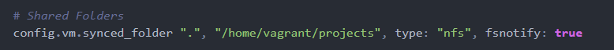

# The Beginner's Guide to Installing a Virtual Machine with Vagrant on Windows…

##  1. Can you run a virtual machine?
- [ ] a. Check if virtualization is turned on.
  - [ ] Right click on the start button, click Run, type
        
        msinfo32  
  - [ ] Make sure you are on the System Summary Tab (left)
  - [ ] On the right, scroll to the bottom and make sure Hyper-V is enabled  
      
        Hyper-V Virtualization Enabled in Firmware - Yes
        
    
    
  - [ ] Proceed to Step 2 (Install the Tools)
  
- [ ] Turn on Virtualization  if it is not on. Follow the links to assist you 
if you do not know how to do this. *Please note*, as Window's machines are made by different manufacturers the process may differ slightly, but the general concept is the same.
    - [ ] [Turn on Virtualization ](https://www.youtube.com/watch?v=tTS0SF_s-0g)
    - [ ] [Check for Virtualization](https://www.shaileshjha.com/how-to-find-out-if-intel-vt-x-or-amd-v-virtualization-technology-is-supported-in-windows-10-windows-8-windows-vista-or-windows-7-machine/)
     

        
   
## 2. Install the tools

 - [ ] a. Install Virtual Box 
 [Virtual Box](https://www.virtualbox.org/wiki/Downloads)
 - [ ] b. Install Vagrant 
 [Vagrant](https://www.vagrantup.com/)
 - [ ] c. Check your vagrant installation. Open your bash terminal (ubuntu 
 bash, git bash) and run the command. If everything is ok you will see info about vagrant      
      
        vagrant  
    

     
## 3. The dev Environment

### Get the vagrant file for setup
  - [ ] Copy the content from the Vagrantfile
      [Vagrantfile](https://github.com/codingphasedotcom/vagrant-settings/blob/master/Vagrantfile)
      
     ### The Goodies
     
      - [ ] Open virtual box application and leave it running in the 
          background.
      - [ ] Navigate to home folder and create a folder named projects (C:\projects)
      - [ ] Open bash terminal in this location. \*\*(If you do not have ubuntu bash you can use git bash which is an alternative bash for windows. It installs git and has a bash terminal bundled called git bash. Download and install using defaults [https://git-scm.com/downloads](https://git-scm.com/downloads) )
      - [ ] In terminal, navigate into your projects folder
           
                cd projects
                
      - [ ] Initialize vagrant
                
                vagrant init
                
      - [ ] You should now have a file *Vagrantfile*. Open Vagrantfile in
           your code editor (vscode, atom, sublime etc) and replace the 
           content in this file with the content you copied from the 
           *vagrant-settings repo Vagrantfile*. Save the file.
           
     - [ ] Install the virtual machine (Be patient. May take a while. Depends on your system).
                        
                vagrant up
                        
     - [ ] Using bash terminal in Windows, enter the virtual machine
                        
                vagrant ssh 
                
     - [ ] Using your Windows bash terminal, if you have been successful to this point, test it out by viewing the files/folders in your home directory. 
                             
                    ls  
            
          
      - [ ] Navigate to the projects folder           
                                                        
                  
              cd projects 
                
  
  
   ### The Dev Starter Kit
   - [ ] Download the most recent version of the starter kit [Dev-Starter-Kit](https://github.com/codingphasedotcom/Dev-Starter-Kit)
   - [ ] Extract and rename the folder to "starter-kit-vagrant" for example.
   - [ ] Copy this folder (there are hidden files so do not copy the folder contents alone, Copy the entire folder with its contained files) to the projects folder (C:\projects\starter-kit-vagrant)
   - [ ] Navigate to the starter kit folder   
                         
          cd starter-kit-vagrant
   - [ ] Make sure you are in the root of the starter kit. If the package.json file is listed, you're in the right place.            
        
          ls
    

  - [ ] install starter kit dependencies  
      
        npm install
    
    
## ERROR FIX

if it applies to you 

  
  
  - [ ] Clean cache    
      
        npm cache clean --force
    
  - [ ] Delete node modules folder       
      
        rm -rf node_modules
      
  - [ ] install starter kit dependencies      
      
        npm install --no-bin-link
      
  This is the end of the error stuff.
      
  ### Double Check Time...
  
  - [ ] Make sure you have gulp, gulp-cli, webpack, webpack-cli installed    
      
        gulp -v
      
        webpack -v
      
  - [ ] If not installed, run the following commands (or the ones that apply)         
      
        sudo npm install gulp@4.0
      
        sudo npm install webpack@4.25.1 -g
      
        sudo npm install webpack-cli@3.1.2 -g
      
  ### Start the Starter Kit
      
  - [ ] Start it up...       
      
        npm run watch
      
  - [ ] Test that it's working. In your browser go to http://localhost:3000
  
  ### FIX For The File Watcher
  
  - [ ] If your virtual machine is still running, shut it down      
      
        exit
      
        vagrant halt
      
  - [ ] Open Vagrantfile in your code editor and add the following      
      
        fsnotify: true
      
  
  
  - [ ] In your bash terminal on Windows install the fsnotify plugin
        
        vagrant plugin install vagrant-fsnotify
        
  - [ ] Turn on the virtual machine
        
        vagrant up
        
  - [ ] Enter virtual machine
        
        vagrant ssh
        
  - [ ] Navigate to starter kit root
        
        cd/projects/starter-kit-vagrant
        
  - [ ] Run the starter kit
        
        npm run watch
        
  - [ ] Open another terminal window and run the file watcher 
        
        vagrant fsnotify
        
  
  #### Credits 
  Created by [Karen Headley](https://khdevtt.com)    to assist the students 
  of [CodingPhase](https://codingphase.com)
  
  ##### Any reproduction or alteration without the express consent of the creator is strictly forbidden.
  
